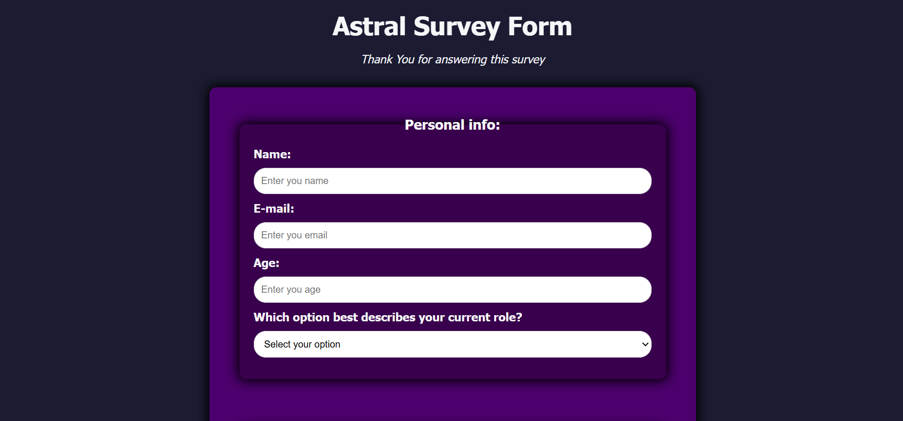

# Survey Form 📝

A simple survey form built with **HTML & CSS**.  
This project is part of my learning journey as a Full-Stack Web Developer.  

## 🌐 Live Demo  
👉 [Click here to view](https://your-username.github.io/survey-form/)  

## ⚡ Features
- Responsive design  
- Clean layout  
- Simple form validation (basic HTML5)  

## 📂 Technologies Used
- HTML5  
- CSS3  

## 📸 Screenshot
  

## 🚀 Future Improvements
- Add JavaScript for dynamic validation  
- Store responses in a backend (later projects)
